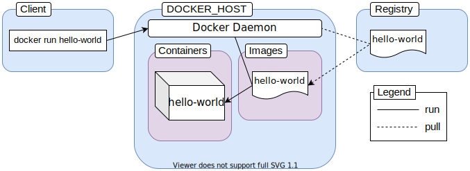

# Docker Introduction

According to IBM,

Containerization involves encapsulating or packaging up software code and all its dependencies so that it can run uniformly and consistently on any infrastructure.

Example of minimal containerization with Docker:
```
docker run hello-world
```
To have a look at all the containers that are currently running or have run in the past:
```
docker ps -a
```
Docker Architecture and three very fundamental concepts of containerization in general:
- Container

    A container is an abstraction at the application layer that packages code and dependencies together. Instead of virtualizing the entire physical machine, containers virtualize the host operating system only.

- Image

    Images are multi-layered read-only files carrying your application in a desired state inside them.
    Images can be exchanged through registries.

- Registry

    An image registry is a centralized place where you can upload your images and can also download images created by others. Docker Hub is the default public registry for Docker.

---
## Docker Engine
---

The engine consists of three major components:

### Docker Daemon:
The daemon (dockerd) is a process that keeps running in the background and waits for commands from the client. The daemon is capable of managing various Docker objects.

### Docker Client:
The client  (docker) is a command-line interface program mostly responsible for transporting commands issued by users.

### REST API:
The REST API acts as a bridge between the daemon and the client. Any command issued using the client passes through the API to finally reach the daemon.




---
## Docker Container Manipulation 
---
Container manipulation is one of the most common task so a proper understanding of the various commands is crucial.

The generic syntax:
```
docker <object> <command> <options>
```
* object indicates the type of Docker object you'll be manipulating. This can be a container, image, network or volume object.
* command indicates the task to be carried out by the daemon, that is the run command.
* options can be any valid parameter that can override the default behavior of the command, like the --publish option for port mapping.

---
### Publishing a Port
---
Containers are isolated environments. Your host system doesn't know anything about what's going on inside a container. Hence, applications running inside a container remain inaccessible from the outside. To allow access from outside of a container, you must publish the appropriate port inside the container to a port on your local network. The common syntax for the --publish or -p option is as follows:
```
--publish <host port>:<container port>

--publish 8080:80  (request sent to port 8080 of host system will be forwarded to port 80 inside the container‌)
```
---
### Using Detached Mode
---
To keep the container running even if terminal is closed:
```
docker container run --detach --publish 8080:80 registryName/imageName
```
---
### Listing containers
---
To list running containers only:
```
docker container ls
```
To list all containers, including ones running in the past :
```
docker container ls --all
```
---
### Naming and renaming containers
---
By default, every container has two identifiers. They are as follows:

* CONTAINER ID - a random 64 character-long string.
* NAME - combination of two random words, joined with an underscore.

To give container a name:
```
docker container run --detach --publish 8888:80 --name < new Name > < registryName/oldName >
```
To rename old containers:
```
docker container rename <container identifier> <new name>
```
---
### Start, stop, restart, kill containers
---
To stop container running in the foreground:
```
ctrl + C
```
for background running container:
```
docker container stop
                 kill
                 restart < container name >
```
To start container:
```
docker container start < container id or name >
```
---
### Create and remove containers
---
To only create container without starting it and start it later:
```
docker container create --publish 8080:80 < registry/name >

docker container start < container name >
```

Containers that have been stopped or killed remain in the system. These dangling containers can take up space or can conflict with newer containers.

To remove stopped, killed, or not used containers:
```
docker container rm < container id or name> < container id or name> < container id or name> ...
```
---
### Run Container in Interactive mode
---
```
docker container run --rm -it ubuntu
```
With -it flag, container will start and shell from the inside of the container will open.   
The --rm flag will remove container when stopped or killed.

---
### Execute comands inside containers:
---
```
docker container run <image name> <command>
docker run alpine uname -a
docker container run --rm busybox echo -n my-secret | base64
```
Most of the images except the executable images use shell or sh as the default entry-point.     
Any valid shell command can be passed to them as arguments.   
Whatever is passed after the image name gets passed to the default entry point of the image.

---
### Working with executable images & bind mounts
---
These images are designed to behave like executable programs.   
One way to grant a container direct access to your local file system is by using bind mounts.   

When you use a bind mount, a file or directory on the host machine is mounted into a container
A bind mount lets you form a two way data binding between the content of a local file system directory (source) and another directory inside a container (destination). This way any changes made in the destination directory will take effect on the source directory and vise versa.
```
docker run -d \
  -it \
  --name devtest \
  -v "$(pwd)"/target:/app \
  nginx:latest
```
If you use -v or --volume to bind-mount a file or directory that does not yet exist on the Docker host, -v creates the endpoint for you. It is always created as a directory.
```
docker run -d \
  -it \
  --name devtest \
  --mount type=bind,source="$(pwd)"/target,target=/app \
  nginx:latest
  ```
If you use --mount to bind-mount a file or directory that does not yet exist on the Docker host, Docker does not automatically create it for you, but generates an error.

